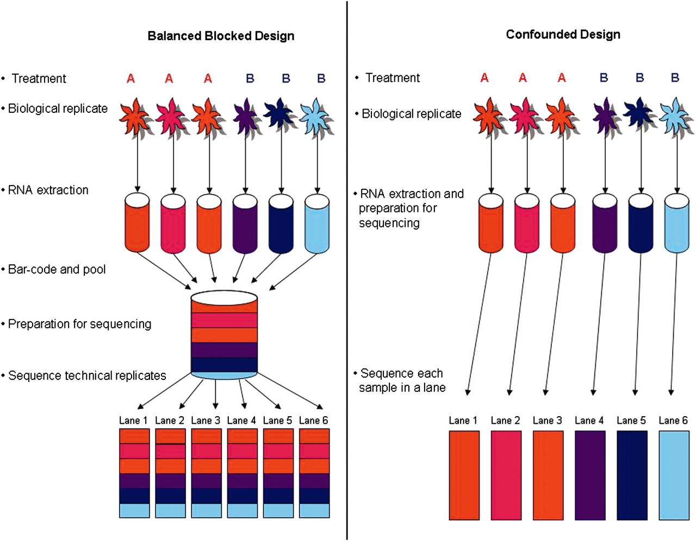

```{r, load_refs, echo=FALSE, cache=FALSE}
library(RefManageR)
BibOptions(check.entries = FALSE, 
           bib.style = "authoryear", 
           cite.style = 'authoryear', 
           max.names = 2,
           style = "markdown",
           hyperlink = FALSE, 
           dashed = FALSE)
myBib <- ReadBib("assets/example.bib", check = FALSE)
```

class: title-slide
background-image: url("assets/USydLogo-black.svg"), url("assets/USYDTitle.png")
background-position: 10% 90%, 100% 50%
background-size: 160px, 50% 100%
background-color: #e64626

# .text-shadow[.white[RNA-seq data analysis]]
## .black[Introduction.]
### .black[Author: Darya Vanichkina]
### .black[Date: March 23, 2019]

```{r setup, include=FALSE}
library(tidyverse)
# If you'd like to create your own title slide, disable xaringan's title slide with the seal = FALSE option of moon_reader.
#<< # highlight code lines
# highlight.output=c(1, 3)
# use local remark.js chakra: libs/remark-latest.min.js
# options(servr.daemon = TRUE)
#options(htmltools.dir.version = FALSE)
# library(pagedown)
# pagedown::chrome_print("01_IntroductionToMLConcepts.html")
#pagedown::chrome_print("01_IntroductionToMLConcepts.Rmd")
```


---

## Course overview

1. Introduction
  - The diverse aims of RNA sequencing
  - Experimental design 
  - Overview of "standard" RNA-seq data analysis
2. From raw data (fastq) to a count table, using the Artemis HPC [optional]
3. From a count table to a list of differentially expressed genes
4. From a list of differentially expressed genes to an inference about affected biological pathways

---


## Central dogma of molecular biology

.center[

]

.right[
*Tracy Chew*
]


---

## RNA sequencing: overview

.center[

]

.right[
*Tracy Chew*
]

---

## RNA sequencing: adapters and difference from genomic DNA

.center[

]

.right[
*Tracy Chew*
]

---
class: segue-red
# Before you do any sequencing

---
## Generic roadmap for RNA-seq computational analyses

.center[

]

.right[
`r Citet(myBib,"conesa2016survey")` 
]

---
## First question to ask: WHY are you sequencing????

<blockquote>
What do you hope to find? What follow-up experiments do you plan to do **after** the sequencing?
</blockquote>

--

RNA-seq can be used to carry out accurate analysis of:

- differential gene expression (DGEA)
- pathway analysis
- Whole gene coexpression network analysis (WGCNA)
- alternative splicing (AS)
- novel transcript reconstruction and annotation
- allele-specific expression of variants
- RNA editing and other modifications
- ... 

--
.center[
<blockquote>
But all of these cannot be accurately analysed at the same time in ONE SINGLE experiment!!!
</blockquote>
]


---
## The main trade-off: replicates vs library depth

The main equation for any RNA-seq experiment is:

<blockquote>
$X_dollars = #replicates x library_prep_cost + #replicates x sequencing_depth_per_replicate ~ sequencing_length
</blockquote>

Some analyses are impossible to do without sufficient library depth:

- alternative splicing (AS)
- novel transcript reconstruction and annotation *
- allele-specific expression of variants
- RNA editing and other modifications *

--

\* - special protocols have been developed to enrich for rare molecules, thus reducing the need for "brute force" increases in library depth

---
## The main trade-off: replicates vs library depth

- But if you are doing a "stock standard" differential gene expression analysis, it may be substantially more prudent to increase the number of replicates, NOT the library depth, especially in the context of:

  - differential gene expression (DGEA)
  - pathway analysis
  - Whole gene coexpression network analysis (WGCNA) /needs minimum 15!!!/
  
--

- This may involve accepting that you won't be able to do alternative splicing analysis and/or novel transcript annotation

--

- ... BUT if you weren't planning on validating them anyway, they may not add that much to your experiment ...

--

- ... while costing you the ability to accurately really narrow down the list of genes involved in your specific process

---
## How much of an effect could library depth vs number of replicates have?

.center[

]

.right[
`r Citet(myBib,"conesa2016survey")`
]

???

Note 70 aligned reads for the gene in the effect size comparison


---
## What is a replicate?

--
- Technical replicate: 
  - same cell line
  - same dish
  - same iPSC/ESC clone
  - typically, Pearson correlation coefficient > 0.9
  - sometimes: same libary, different flow cells

--

- Biological replicate: 
  - different animals
  - different iPSC lines from different donors
  - no clear filter for correlation coefficient, but usually < 0.9

---
## Batch effects

  - differences in baseline between replicate samples prepared under different conditions
  - can be:
    - obvious: control for
    - hidden: EDA

--

.blockquote[ Important: 

If you expect to have batch effects (samples prepared on different days, for example), ENSURE you have all conditions you expect to use in a differential analysis in EVERY batch (for example, treatment and control, every time you do the experiment).
]

---

## How many replicates?

1. MINIMUM 3 per condition, NO discussions about it... but better ...

2. ... see `r Citet(myBib, c("conesa2016survey", "schurch2016many"), max.names = 2)` for additional discussion, or ...

3. (best) use a tool such as [RNASeqPower](https://bioconductor.org/packages/release/bioc/html/RNASeqPower.html) to calculate formally

---
## General considerations

1. Library type: usually paired-end, although single end also works for basic DGEA, and allows you to get double the reads for your dollar... (almost - also need to take library prep into account) 
2. Spike-ins: use up sequencing resource, but allow more accurate normalisation for DGEA
3. Randomisation in sequencing runs: should be standard 
4. Stranded vs unstranded 
5. poly-A selected vs total RNA


---
## Experimental design

.center[

] 

.right[
`r Citep(myBib,"auer2010statistical")`
]
---
## Basic analysis ( * today)

1. Raw sequencing reads in fastq format
2. Mapped to the genome using a splicing-aware aligner
3. Summarise reads over genes to generate a count table
4. Assess mappping quality
5. Determine differentially expressed genes using R *
6. Carry out exploratory pathway analysis using ToppGene *


---
## Fastq format

.center[

]

- The quality at each position is captured as $Q = -10log_{10}p$, where p is the probability the base was called incorrectly. 

--

- Several different encodings have been used throughout the years to report on this by Illumina (thanks!), and the [Wikipedia](https://en.wikipedia.org/wiki/FASTQ_format) page is the best place to figure out which is which.

.center[

]

???
Challenge: Which format is the data coming from?


---
## The quality of a fastq file is assessed using fastqc

.pull-left[

#### Normal data:


]

.pull-right[

#### Bad data:


]


.right[
[From fastqc documentation](https://www.bioinformatics.babraham.ac.uk/projects/fastqc/) 
]


---
## Mapping

- RNA-seq specific aligner needs to be used to accomodate splicing
- Commonly used tools are STAR, HISAT2, as well as tophat
- Different tools are appropriate for long-read sequencing!
- The output of all of these tools is a bam file, which is a compressed ("B"inary) form of a sam file

---
## Sam (Sequence alignment/mapping) file format 

- standard mapping format
- [samtools](http://www.htslib.org/doc/samtools.html) is a suite of tools for working with sam/bam/cram files
- [full documentation](https://samtools.github.io/hts-specs/SAMv1.pdf)


.right[
[Image from GATK](https://gatkforums.broadinstitute.org/gatk/discussion/11014/sam-bam-cram-mapped-sequence-data-formats)
]


---
## Sam file format: header

- to see header: `samtools view -H filename.bam`
- reference chromosomes and their lengths
- which tool was used to generate the data
- what parameters were used (exactly what is reported depends on mapper)

```
@HD	VN:1.4	SO:coordinate
@SQ	SN:chr1	LN:248956422
@SQ	SN:chr2	LN:242193529
@SQ	SN:chr3	LN:198295559
@SQ	SN:chr4	LN:190214555
@SQ	SN:chr5	LN:181538259
@SQ	SN:chr6	LN:170805979
<... more chromosomes and lengths>
@PG	ID:STAR	PN:STAR	VN: # etc etc
@CO	user command line:...
```


---
## Counting reads to genes


.pull-left[

1. "Collapse" transcript annotation to gene level
2. Overlap read with collapsed gene (taking or not taking strand into account)
3. Tally to get a count table

]

.pull-right[
.center[

]
]


---
## A count table

- very high-dimensional data: few samples, many "parameters"

| Gene	|	Sample1	|	Sample2	|	Sample 3|
| ------: | ------: | -----: |-----: |
| ENSG00000237613.2	|	10	|	12	|	9|
| ENSG00000268020.3	|	0	|	0	|	0|
| ENSG00000240361.2	|	2	|	7	|	7|
| ENSG00000186092.6	|	0	|	0	|	0|
| ENSG00000238009.6	|	0	|	0	|	0|
| ENSG00000239945.1	|	1092	|	987	|	432|
| ENSG00000233750.3	|	0	|	0	|	0 |
| ...	|	0	|	0	|	0 |
| 56000+ more rows ... | 	|		|	 |


---
## Basic analysis

1. Raw sequencing reads in fastq format
2. Mapped to the genome using a splicing-aware aligner
3. Summarise reads over genes to generate a count table
4. **Assess mapping quality **
5. Determine differentially expressed genes using R *
6. Carry out exploratory pathway analysis using ToppGene *

???
Comment on what tools and approaches may be used to do this 


---
## Differential gene expression analysis

- For each gene we have a measure of abundance: reads mapping to that gene in each library
- Question: is the number of reads mapping to the gene in a set of samples (condition A) different to the number of reads mapping to the gene in another set of samples (condition B)?

--
- Need to account for:
  - Library depth!
  - Data is not distributed normally!
  - Lots of zero or near-zero counts (most genes are not expressed or expressed at low levels)


---
## The challenge with lowly expressed genes
- Assume we've adjusted the library depth to be the same for both examples

.pull-left[
Condition 1:

```{r echo=F}
print(data.frame(ReplicateSample = c("Sample1", "Sample2", "Sample3", "Sample4", "Sample5", "Sample6"), Gene1 = c(4,6,1,4,6,1), Gene2 = c(400,600,100,400,600,100)))
```


]

.pull-right[

Condition 2:

```{r echo=F}
print(data.frame(ReplicateSample = c("Sample1", "Sample2", "Sample3", "Sample4", "Sample5", "Sample6"), Gene1 = 2* c(4,6,1,4,6,1), Gene2 = 2* c(400,600,100,400,600,100)))
```

]

.center[Which of these would you consider exploring further?]


---
## Decisions that need to be made during DGEA
1. How will you filter for lowly expressed genes?
2. How will you normalise the data?
3. Do you need to explicitly account for batch effects?

.small[
.blockquote[
1. There is no "one size fits all" for RNA-seq! /as for most other sequencing-based experiments/

2. Whoever is analysing the data is making "subjective" decisions about parameters and options, and is contributing to the research intellectually*.

3. These parameters **must** be reported in the methods section of your manuscript, and analysis scripts should be deposited on github.

4. If you are using a GUI like Galaxy to obfuscate the command-line, you still need to dig into all of the dropdown menu options, to figure out which default parameters are being used to run your analyses, and report these. 
]


.right[
\* *Or not, in which case the data may not be reliable at all...*
]
]


???
Mention that obfuscation and digging quickly grow old, and most people move to the command line for the greater power and flexibility, and lower hassle.


---
## Note

.blockquote[
*To consult the <s>statistician</s> bioinformatician after an experiment is finished is often merely to ask him to conduct a post mortem examination. He can perhaps say what the experiment died of.*
]
.right[
Sir Ronald Fisher (1890-1962)
]

---
## Statistical tests for differential expression

The most widely used libraries for differential expression analysis using RNA-seq either:

### 1. Use the negative binomial distribution to model the count data 

- edgeR
- DESeq2
- baySeq
- EBSeq
- BBSeq

### 2. Transform the counts to be normally distributed using precision weights, and then use normal-based methods

- limma voom

???
Limma:
-  Obtain variance estimates for each observation using mean-var trend.
- Assign inverse variance weights to each observation.
- Weights remove mean-variance trend from the data.

---
## Roadmap for RNA-seq computational analyses

.center[

]

.right[
`r Citet(myBib,"conesa2016survey")` 
]

---
## The study

1. Describe a ChIP-seq like protocol for identifying novel long RNAs that are targets of miR-29b. A chemically modified miR-29b mimic is used to pull down targets, with a scrambled non-specific oligonucleotide serving as a control.
2. Differential gene expression analysis used to show enrichment in previously known miR-29b targets and pathways affected by this miRNA
3. Special consideration (using a design formula) had to be given to identify only things enriched between [specific_pulldown - input], and not [scrambled_pulldown - input].
4. HeLa cells, 3 replicates each, paired-end 100 nt strand-specific sequencing

`r Citep(myBib,"choudhary2018identification")`


---
## References

```{r, results = "asis", echo=FALSE}
PrintBibliography(myBib)
# If you have a long list of references, and want to split them over multiple slides, you can use the `start` and `end` arguments to the `PrintBibliography()` function.  E.g.
# .small[
#`PrintBibliography(bib, start=1, end=7)`
#]
```


